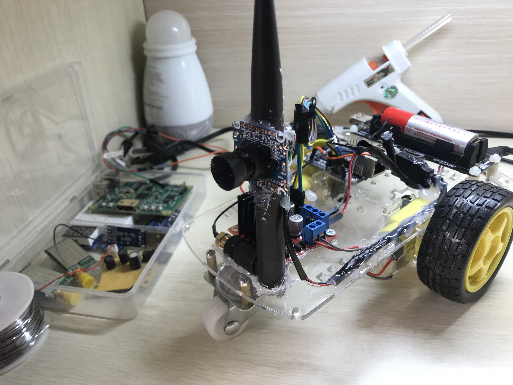

### 一个使用 orange pi zero 来驱动的带摄像头的小车

目前还没有使用AI，所以现在仅仅是一个遥控小车，而不是智能小车。这个小车的名字叫monkey。

它是这样的：



车子的前后左右，是通过车轮控制的。这个小车一共有3个轮子，2个马达。马达的转动，靠一个硬件驱动模块来实现。输入5v电压，4个高电平触发，可以让2个马达呈现各种转动状态。

orange pi zero 左侧有26个pin，右侧的不知道有什么用，没有找到资料，不知道右侧具体的pin都是什么。但是左侧的是这样的：


在这个例子里，使用第15、19、21、23号pin。pin的名称分别是pa3、pa15、pa16和pa14。

但是在控制gpio的时候，算法如下：

> (P后面的字母在字母表(26)中的位置 - 1) * 32 + 后面的数字

```    
PA3 = (1-1)*32+3 = 3

PA15 =(1-1)*32+15 = 15

PA16 = (1-1)*32+16 = 16

PA14 = (1-1)*32+14 = 14
```

最终，需要在shell里写3、15、16和14。

操作gpio的shell代码如下：

```
#!/bin/bash
if [ ! -d /sys/class/gpio/gpio$1 ] ;then
  echo $1 > /sys/class/gpio/export
fi
echo out > /sys/class/gpio/gpio$1/direction
echo $2 > /sys/class/gpio/gpio$1/value
```

现在，gpio的问题解决了，即可通过ssh登陆，输入命令实现对小车的控制。

为了方便使用wifi控制，可以在orange pi上面安装热点。

我的orange pi zero 安装的是dietpi系统。但写这篇文档时，再去dietpi官网，发现已经不支持orange pi了。

但是armbian是支持这一款的。传送门直接下载：https://dl.armbian.com/orangepizero/Ubuntu_bionic_next.7z


开启wifi热点后，默认ip是192.168.42.1。因此可以在手机连接热点，通过该ip进行访问。

由于该小车上面插了一个usb的摄像头。因此需要安装motion来做视频采集。


为了加快速度，可设置国内源：

```
nano /etc/apt/sources.list
```

设置为：

```
deb http://mirrors.tuna.tsinghua.edu.cn/raspbian/raspbian/ jessie main non-free contrib
deb-src http://mirrors.tuna.tsinghua.edu.cn/raspbian/raspbian/ jessie main non-free contrib
```

安装 motion

```
apt install motion
```

修改2处配置：

```
sudo nano /etc/default/motion
```

改成
```
start_motion_daemon = yes
```

```
sudo nano /etc/motion/motion.conf
```

改成
```
stream_localhost off
```

现在，通过192.168.42.1可以看到视频了。

这时需要写一个网站，通过调用api的方式，实现前后左右等动作。而不是每次ssh进去输入命令控制小车。

安装npm

```
apt install npm
```

安装n模块

```
npm install n -g
```
安装稳定版node
```
n stable
```

这个时候，使用express写一个简单的网站。我已经写好了，可以直接clone进来。

在root用户下面clone项目：

```
git clone https://github.com/how-to-make-a-robot/monkey.git
```

```
cd monkey
npm install
```

设置启动项

```
nano /etc/rc.local
```

增加如下一行

```
su root -c "bash /root/monkey/start.sh"
```

然后重启好了：

```
reboot
```

重启后，连接orangepi的热点，输入192.168.42.1:3000，即可体验了。


### 不足之处：

1 这次演示，故意让每一个动作都只执行很短的时间。要不然一开动，就奔出去好几米。

所以改进的方式，是增加一个减速齿轮。但目前没有。

2 摄像头延时现象严重。小车转弯后，画面停顿一两秒才传过来。而手机和小车距离还不超过1尺。

3 电池不给力。我用的是18650电池。充好电后，只能玩20分钟。是不是orange pi太费电了？

### 如果你对小车感兴趣，可以联系我，我们一起做人工智能的遥控车

我的微信是：cr4fun