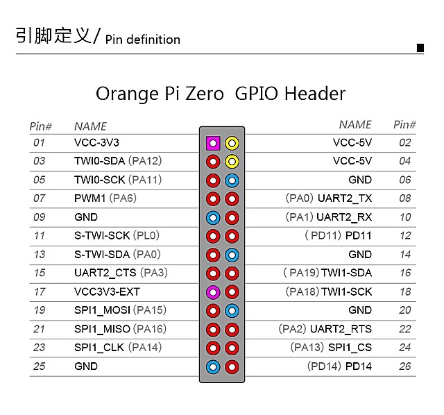

### 一个使用orange pi zero来驱动的带摄像头的小车

目前还没有使用AI，所以现在仅仅是一个遥控小车，而不是智能小车。这个小车的名字叫monkey。

首先，车子的前后左右，是通过车轮控制的。这个小车一共有3个轮子，2个马达。

马达的转动，靠一个硬件驱动模块来实现。输入5v电压，4个高电平触发，可以让2个马达呈现各种转动状态。

orange pi zero 安装了dietpi。

开启wifi热点。默认ip是192.168.42.1


设置源为国内源

```
nano /etc/apt/sources.list
```

```
deb http://mirrors.tuna.tsinghua.edu.cn/raspbian/raspbian/ jessie main non-free contrib
deb-src http://mirrors.tuna.tsinghua.edu.cn/raspbian/raspbian/ jessie main non-free contrib
```

安装 motion (摄像头)

```
apt install motion
```

```
sudo nano /etc/default/motion
```

```
start_motion_daemon = yes
```

```
sudo nano /etc/motion/motion.conf
```


```
stream_localhost off
```


安装npm

```
apt install npm
```

安装n模块

```
npm install n -g
```
安装稳定版node
```
n stable
```

更新 npm

```

```


```
npm install
```

```
node app.js
```

```
npm install pm2 -g
```

```
nano /etc/rc.local
```

```
cd /root/monkey
./start.sh
```

```
su root -c "bash /root/monkey/start.sh"
```


### 控制



> (P后面的字母在字母表(26)中的位置 - 1) * 32 + 后面的数字

```    
PA3 = (1-1)*32+3 = 3

PA15 =(1-1)*32+15 = 15

PA16 = (1-1)*32+16 = 16

PA14 = (1-1)*32+14 = 14
```

